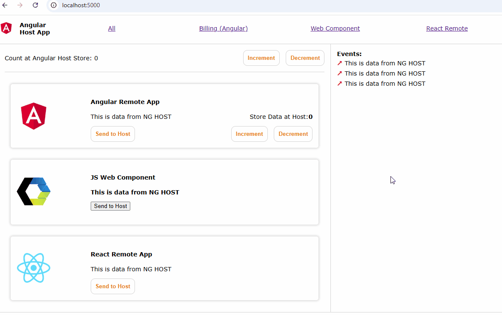
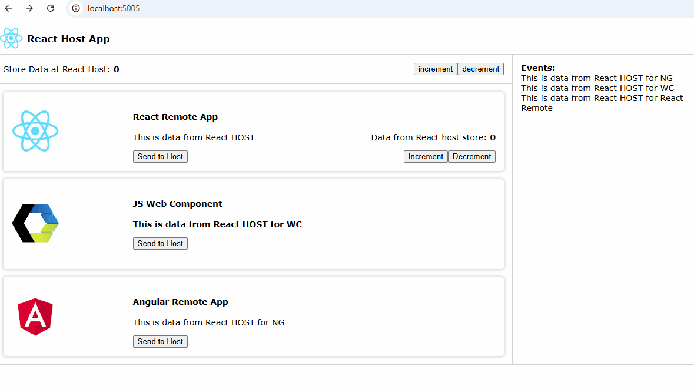

# Module Federation Demo
This repo contains module federation demo code for running Angular, React and JS Web Component apps inside an Angular Host and a React Host app along with examples for inter module communication. 

## Details
Using this repo, we shall setup:
- Angular Host and add the following remotes:
    - Angular Remote
    - React Remote
    - Plain JS Web Component
- React Host and add the following remotes:
    - Angular Remote
    - React Remote
    - Plain JS Web Component

## Communication between Host and Remotes
- Parent to Child and vice-versa
- Custom Events
- Store
- Services (Angular Only)

## Setup
- Navigate into each ng-* and react-* folders and run `npm install`
- In ng-* folder run `ng serve` to start the angular app
- In react-* folder run `npx webpack serve` to start the angular app

### Port Details
- Angular Host (ng-shopping-host): `https://localhost:5000`
- Angular Remote (ng-billing-remote): `https://localhost:5001`
- Angular Remote (ng-orders-remote): `https://localhost:5002`
- React Host (react-host-app): `https://localhost:5005`
- React Remote (react-remote-app): `https://localhost:5004`
- Web component (wc-users-app): NA

### Running Angular MF Setup
- Copy the `wc-users-app/usersApp.js` into `ng-shopping-host/public/assets` to enable loading the web component.
- Once you open `https://localhost:5000`, you should see 4 tiles on the home, first 2 loading ng-*-remote apps and the next two loading `wc-users-app` and `react-remote-app`.

### Running React MF Setup
- Copy the `wc-users-app/usersApp.js` into `ng-shopping-host/public/assets` to enable loading the web component.
- In `ng-orders-remote`, run `ng build` and copy all the `.js` files in `dist\ng-orders-remote` folder to `./public/assets/angular` in the react host app. This loads `ng-orders-remote` as a angular element/custom element.
- Once you open `https://localhost:5005`, you should see React remote app, web-component app and angular remote app all loading in react host.

### Points to note
The default angular/react project creation didnt work for webpack module federation config. So the repos needed some tweaking. The below steps are only for info/reference. Doing `npm install` in each repo will pull all the required dependencies. However, if you want to setup from scratch, you can use the below steps.

#### Angular
- Creating a new app with `ng new` doesnt give you the `webpack.config.js` file. So we need to add it manually.
- To do this, we run the command `ng add @angular-architects/module-federation`. This will create the `webpack.config.js` file and update other json files.
- We load angular remote as a web-component in react host app. To convert a angular component, we will use `npm i -D @angular/elements`.
- For NGRx store setup, use `npm i -D @ngrx/store @ngrx/effects @ngrx/store-devtools` in both host and remote apps.

#### React
- For this demo, we created a react app from scratch with the following commands.
- After a new folder is created, run:
    - `npm i -D react react-dom @types/react @types/react-dom` to install react and react-dom along with its types.
    - `npm i -D webpack webpack-dev-server webpack-cli html-webpack-plugin` to install webpack and related deps to run the app in webpack-dev-server.
    - `npm i -D babel-loader @babel/core @babel/preset-env @babel/preset-react @babel/preset-typescript` to install babel related plugins for transpiling typescript
    - Add `{"presets": ["@babel/preset-env", "@babel/preset-react", "@babel/preset-typescript"]}` in a `.babelrc` file.
    - For Redux setup, use `npm i -D redux react-redux @reduxjs/toolkit` in both host and remote apps.

### Additional Links
- Angular
    - [Angular Architects Module Federation](https://www.angulararchitects.io/en/)
- Web Components
    - [Web Components](https://developer.mozilla.org/en-US/docs/Web/API/Web_components)
    - [Custom Events](https://developer.mozilla.org/en-US/docs/Web/API/CustomEvent/CustomEvent)
    - Libraries to create Custom Components: [Stencil JS](https://stenciljs.com/), [Lit](https://lit.dev/docs/v1/lit-html/introduction/)
- Webpack
    - [Module Federation](https://webpack.js.org/concepts/module-federation/#root)

### Demo

#### Angular

#### React

